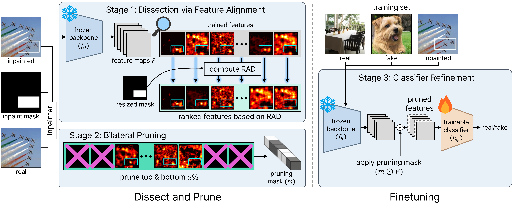

# DEAR: Dissect and Prune, Enhancing Robustness in AI-Generated Image Detection

<p align="center">
  <a href="https://icml.cc/media/PosterPDFs/ICML%202026/64805.png?t=1783235112.5203261"></a>
  <a href="https://arxiv.org/abs/2606.10309"></a>
  <a href="https://huggingface.co/k-aisi-anti-deepfake"></a>
  <a href="LICENSE"></a>
</p>

📧 **Contact:** Dahye Kim (kkamidahye@gmail.com), Jang-Ho Choi (corresponding, janghochoi@etri.re.kr)

Official implementation of **"Dissect and Prune: Enhancing Robustness in AI-Generated Image Detection"** (ICML 2026).

> **TL;DR**: Existing AI-generated image (AIGI) detectors suffer from a *prediction asymmetry*: they stay highly accurate on **real** images but collapse on **generated** images once those are compressed or resized. DEAR uses **inpainted diagnostic images** to **dissect** a detector's feature channels by how strongly they align with generated regions (Regional Activation Discrepancy, RAD), **bilaterally prunes** the channels at both extremes, and **refines** the classifier on the original training data together with the inpainted diagnostic data, mitigating the influence of fragile, spurious features and restoring robustness.

<p align="center"></p>

## 📣 News
- **[2026-07]** Checkpoints and datasets released on the [Hugging Face Hub](https://huggingface.co/k-aisi-anti-deepfake).
- **[2026-07]** Code released.
- **[2026-05]** DEAR was accepted to **ICML 2026**.

## 🤖 Method
DEAR is a three-stage, post-hoc feature-selection framework applied on top of a **pretrained** detector:

1. **Diagnostic data.** Inpaint a random rectangular region of each real image with Stable Diffusion 1.5, so real and generated pixels coexist within one image under a *known* mask.
2. **Dissect.** For each feature channel, measure the **Regional Activation Discrepancy**
   `RAD = mean(activation inside the inpainted region) − mean(activation in the background)`.
   Strongly positive ⇒ the channel fires on generated content. Strongly negative ⇒ it fires on real content. Near-zero ⇒ no regional preference.
3. **Prune & refine.** Channels at **both extremes** of the RAD distribution are the least robust to post-processing, so DEAR **bilaterally prunes** them (keeping the robust middle band), freezes the backbone, and re-trains the linear classifier on *(original training data + inpaint data)*.

We instantiate DEAR on two base detectors:

| Model | Base detector | Pruning (paper) |
|---|---|---|
| **DEAR-c** | **Corvi**, ResNet-50 on LSUN/COCO real vs. LDM fakes | keep middle **60%** (prune top/bottom 20%) |
| **DEAR-r** | **Rajan** ([AlignedForensics](https://github.com/AniSundar18/AlignedForensics)), ResNet-50 on aligned real/fake pairs | keep middle **40%** (prune top/bottom 30%) |

## ⚙️ Installation
```bash
conda create -n dear python=3.10 -y
conda activate dear

pip install -e .
pip install -r requirements.txt
```

## 📑 Checkpoints
Download the weights into `checkpoints/`:
```bash
huggingface-cli download k-aisi-anti-deepfake/dear-checkpoints --local-dir checkpoints
```
Expected layout:
```
checkpoints/
├── corvi/model_best.pth     # base Corvi detector
├── rajan/model_best.pth     # base Rajan detector
├── dear_c/model_best.pth    # DEAR-c (ours)
└── dear_r/model_best.pth    # DEAR-r (ours)
```

## 🚀 Inference
DEAR ships **two** inference entry points:

| Script | Use it for | Input | Output |
|---|---|---|---|
| **`scripts/inference.py`** | Quick **demo** on a single image or a folder. Loads one model and prints a real/fake verdict per image. | one image, or a folder | per-image logit, `p(fake)`, `REAL/FAKE` |
| **`scripts/bucketed_inference.py`** | **Benchmark evaluation** / reproducing the paper tables. Runs over a structured dataset, groups images by resolution into *buckets* for fast batched GPU inference, and writes per-generator logit CSVs. Any released model via `--model {corvi,rajan,dear_c,dear_r}`. | `data/{split}/{real,fake}/{type}/` | one logit CSV per subset |

Both use **identical** preprocessing (ToTensor + ImageNet normalize, **no resizing** so generative artifacts are preserved). `bucketed_inference.py` is purely a throughput optimization and yields the same logits as `inference.py`. Use the demo for a few images, and the bucketed path for large benchmarks.

**Demo (single image or folder):**
```bash
python scripts/inference.py --model dear_c --input path/to/image.png      # one image
python scripts/inference.py --model dear_r --input path/to/folder/        # a folder
bash   scripts/inference/run_demo.sh dear_c path/to/folder/               # convenience wrapper
```
A **positive** logit ⇒ `FAKE`, a **negative** logit ⇒ `REAL`.

**Benchmark (reproduce the tables):** `--model` accepts any released checkpoint: `corvi`, `rajan`, `dear_c`, `dear_r`.
```bash
# 1-shot: bucketed inference + per-generator metrics + summary table
bash scripts/inference/run_bucketed_eval.sh dear_c ./data

# or step by step:
# 1) batched inference -> one logit CSV per real/fake subset
python scripts/bucketed_inference.py --model dear_c --data_root ./data --test_dirnames test test_processed
# 2) per-generator metrics (writes a .json next to each fake CSV)
python scripts/eval.py \
    --real_csv results/dear_c/test/real/redcaps.csv \
    --fake_csv results/dear_c/test/fake/flux.csv
# 3) tabulate AUC / Acc / R.Acc / F.Acc, averaged over the 9 generators
#    (pass several --methods to compare models side by side)
python scripts/analyze_results.py --results_dir results --methods dear_c \
    --test_dirs test test_processed
```

## 📊 Datasets
See **[docs/DATASET.md](docs/DATASET.md)** for the full `data/` assembly guide. Summary:

| Purpose | Source |
|---|---|
| **DEAR-c training** (LSUN + COCO real, LDM fakes) | 🤗 [k-aisi-anti-deepfake/aigi-detection-ldm](https://huggingface.co/datasets/k-aisi-anti-deepfake/aigi-detection-ldm) hosts **LSUN real + LDM fakes**. **COCO real**: [official COCO 2017](https://cocodataset.org/#download). |
| **DEAR-r training** (aligned real/fake pairs) | 🤗 [AniSundar18/aligned_forensic_trainingdata](https://huggingface.co/datasets/AniSundar18/aligned_forensic_trainingdata). See [AlignedForensics issue #2](https://github.com/AniSundar18/AlignedForensics/issues/2#issuecomment-2978110983) for download details. |
| **Diagnostic inpaint set** (RAD dissection) | 🤗 [k-aisi-anti-deepfake/dear-lsun-inpaint](https://huggingface.co/datasets/k-aisi-anti-deepfake/dear-lsun-inpaint) |
| **Test set** (reproduce Table 1) | 🤗 [AniSundar18/LDMFakeDetect](https://huggingface.co/datasets/AniSundar18/LDMFakeDetect) |
| **Wild benchmarks** (Chameleon / LOKI / WildRF) | see [docs/DATASET.md](docs/DATASET.md) |

## 🔁 Reproducing Training
DEAR is applied **on top of** a pretrained base detector. Most users only need **Step 3**.

**Step 1 (optional): train the base detectors from scratch.**
```bash
bash scripts/train/train_base_detectors.sh    # -> results/{corvi,rajan}/model_best.pth
```
Or simply download `checkpoints/corvi/model_best.pth` and `checkpoints/rajan/model_best.pth`.

**Step 2 (optional): regenerate the diagnostic inpaint set.**
```bash
bash scripts/inpaint_data_gen/commands.sh     # gen_mask.py + SD-1.5 inpainting (multi-GPU)
```
Or download [k-aisi-anti-deepfake/dear-lsun-inpaint](https://huggingface.co/datasets/k-aisi-anti-deepfake/dear-lsun-inpaint).

**Step 3: apply DEAR (dissect + prune + refine).**
```bash
bash scripts/train/train_dear_c.sh    # DEAR-c: prune top/bottom 20% -> results/dear_c/model_best.pth
bash scripts/train/train_dear_r.sh    # DEAR-r: prune top/bottom 30% -> results/dear_r/model_best.pth
```

## 📈 Results
Average over **9 generators** (SD, Midjourney, Kandinsky, Playground, PixArt, LCM, FLUX, Wuerstchen, aMUSEd). DEAR closes the prediction-asymmetry gap, lifting **fake accuracy (F.Acc)** dramatically, most visibly under post-processing.

**Original test images**
| Method | AUC | R.Acc | F.Acc |
|---|:---:|:---:|:---:|
| Corvi | 98.5 | 99.9 | 86.5 |
| **DEAR-c** | 100.0 | 96.3 | **100.0** |
| Rajan | 96.8 | 99.9 | 75.0 |
| **DEAR-r** | 99.9 | 97.4 | **99.2** |

**Post-processed** (random JPEG compression / resize / color jitter)
| Method | AUC | R.Acc | F.Acc |
|---|:---:|:---:|:---:|
| Corvi | 79.2 | 97.3 | 47.7 |
| **DEAR-c** | 92.3 | 76.5 | **90.2** |
| Rajan | 92.9 | 99.9 | 58.2 |
| **DEAR-r** | 97.1 | 95.1 | **89.5** |

See the paper for full per-generator results and the in-the-wild benchmarks (Chameleon, WildRF, LOKI).

## 😄 Acknowledgement
This codebase is built on **[AlignedForensics](https://github.com/AniSundar18/AlignedForensics)** by Anirudh Sundara Rajan et al. We sincerely thank the authors for generously sharing their code and dataset, which this work directly builds upon. The ResNet-50 backbone (`dear/nn_classifier/resnet.py`) is adapted from [GRIP-UNINA](https://github.com/grip-unina) and is licensed under Apache-2.0.

## ✍️ Citation
If you find DEAR useful, please cite:
```bibtex
@inproceedings{kim2026dissect,
  title     = {Dissect and Prune: Enhancing Robustness in AI-Generated Image Detection},
  author    = {Kim, Dahye and Choi, Jaehyun and Seong, Hyun Seok and Kim, Seongho and Lee, Donghun and Yi, Sungwon and Choi, Jang-Ho},
  booktitle = {Proceedings of the Forty-third International Conference on Machine Learning},
  year      = {2026},
  url       = {https://arxiv.org/abs/2606.10309}
}
```
